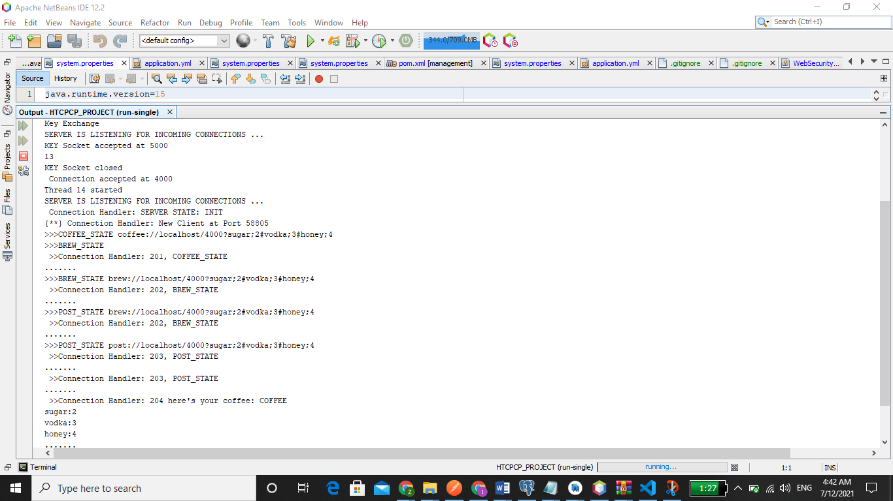

# TCP COFFEE BREWING PROTOCOL

**Tcp client-server implementation of the HTCPCP.** 

To start the coffee brewer program, run the Server.java program first then run the Client.java program

**Sample Screenshot:**

**Application:**
[Debug apk version](app-debug.apk)

**Features:**

*  [x] CLI program  
